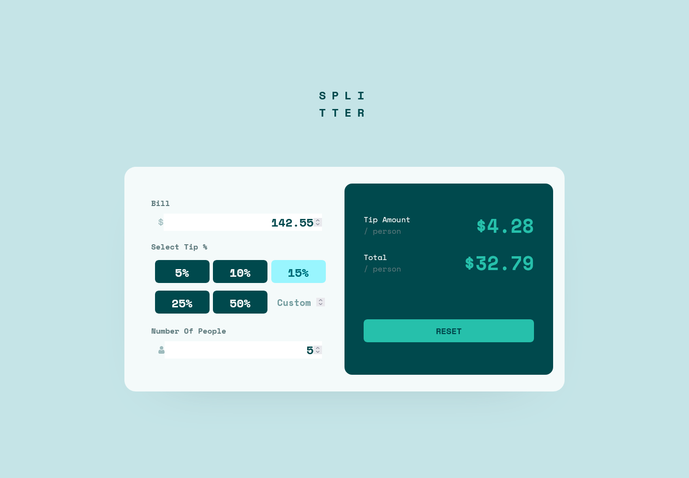
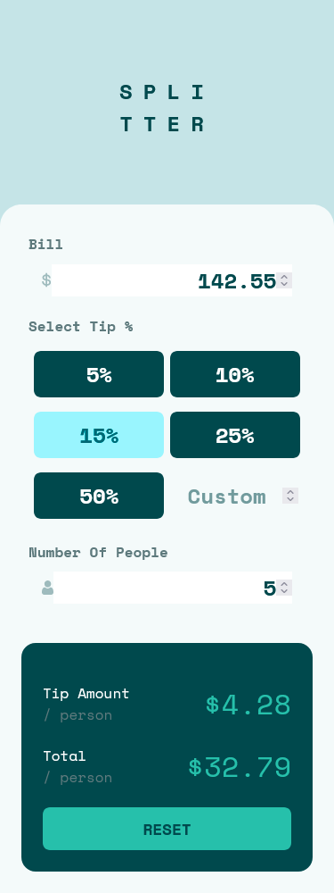

### Live Site: [Link](https://sunil-sharma-999.github.io/Tip-calculator-app/)

# Frontend Mentor - Tip calculator app solution

This is a solution to the [Tip calculator app challenge on Frontend Mentor](https://www.frontendmentor.io/challenges/tip-calculator-app-ugJNGbJUX). Frontend Mentor challenges help you improve your coding skills by building realistic projects.

## Table of contents

- [Overview](#overview)
  - [The challenge](#the-challenge)
  - [Screenshot](#screenshot)
  - [Links](#links)
- [My process](#my-process)
  - [Built with](#built-with)
  - [Useful resources](#useful-resources)
- [Author](#author)

## Overview

### The challenge

Users should be able to:

- View the optimal layout for the app depending on their device's screen size
- See hover states for all interactive elements on the page
- Calculate the correct tip and total cost of the bill per person

### Screenshot

### Links

- Solution URL: [https://github.com/sunil-sharma-999/Tip-calculator-app](https://github.com/sunil-sharma-999/Tip-calculator-app)
- Live Site URL: [https://sunil-sharma-999.github.io/Tip-calculator-app/](https://sunil-sharma-999.github.io/Tip-calculator-app/)

## My process

### Built with

- Semantic HTML5 markup
- CSS custom properties
- Flexbox
- CSS Grid
- Mobile-first workflow
- SCSS

### Useful resources

- [Stack Overflow ReactJS](https://stackoverflow.com/questions/tagged/reactjs)
- [Stack Overflow JavaScript](https://stackoverflow.com/questions/tagged/javascript)

## Author

- [Linktree Link ](https://linktr.ee/Sunil.sharma.9)
